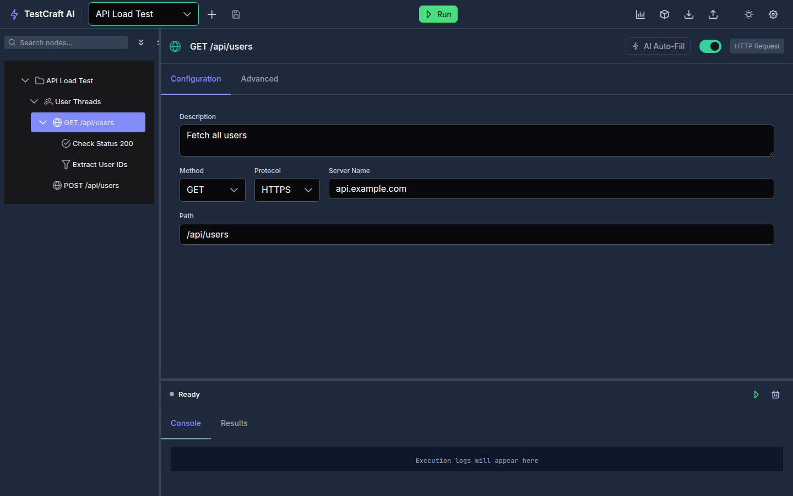

# TestCraft AI

**AI-powered JMeter alternative** — a visual test orchestration platform for designing, executing, and managing performance and integration tests.



## What is this?

TestCraft AI is a modern replacement for Apache JMeter, built as a web application. Instead of JMeter's Java Swing UI, it provides a browser-based visual editor with AI-powered configuration auto-fill. Define test plans visually, execute them across 10 language runners (Java, Python, Go, Rust, C#, JS, TS, Ruby, PHP, Kotlin) orchestrated via Kubernetes, and analyze results in real time.

### Key differences from JMeter

- **Web-based UI** instead of desktop Java app
- **AI auto-fill** — describe what you want to test in natural language
- **100+ node types** — HTTP, GraphQL, gRPC, JDBC, WebSocket, Kafka, MongoDB, Docker, Kubernetes, and more
- **Multi-language runners** — write test logic in any of 10 languages, not just Java/Groovy
- **Real-time execution** — live logs, metrics, and variable tracking via WebSocket
- **HOCON test plans** — human-readable config format instead of XML
- **CLI for CI/CD** — run tests from pipelines with JUnit/HTML/JSON reports
- **RAG knowledge base** — store and reuse code examples and API docs for AI-powered generation

## Features

- **Visual Test Plan Designer** — tree-based interface for designing test plans with drag-and-drop
- **AI Auto-Fill** — describe tests in natural language, AI populates all fields automatically
- **100+ Node Types** — samplers, controllers, assertions, timers, extractors, preprocessors, postprocessors, listeners
- **Real-time Execution** — live logs, metrics, and variable tracking during test runs via WebSocket
- **Automatic Teardown** — containers and resources are automatically cleaned up after tests
- **RAG Knowledge Base** — store and reuse code examples, API docs, and schemas for AI-powered generation
- **CLI Tool** — run tests from command line for CI/CD integration
- **Multi-format Reports** — JUnit XML, HTML, JSON, CSV, Markdown exports

## Prerequisites

- Node.js 20+
- Docker & Docker Compose
- Kubernetes (optional, for k8s nodes)

## Quick Start

```bash
# 1. Install dependencies
npm install

# 2. Start infrastructure (YugabyteDB)
make docker-up

# 3. Start API + frontend
npm run start:api    # Backend on port 3000
npm run start:web    # Frontend on port 4200

# Or start everything at once
npm run start:all
```

**URLs:**
- Frontend: http://localhost:4200
- API: http://localhost:3000
- YugabyteDB UI: http://localhost:7000

## Architecture

TypeScript monorepo with Turborepo:

```
apps/api/              Fastify REST API (port 3000)
apps/web/              Angular 21 frontend (port 4200)
apps/cli/              CLI tool ("testcraft" command)
packages/shared-types/ Shared TypeScript types
docker/runners/        10 language-specific containers
k8s/                   Kubernetes manifests (Kustomize)
tests/framework/       Integration test suite (185 tests)
```

### Infrastructure

**YugabyteDB** (PostgreSQL-compatible distributed database) is the primary data store, running on port 5433. It stores test plans, execution results, audit logs, user sessions, rate limits, and RAG embeddings (via `pgvector` extension). Migrations are managed via a custom runner with checksum-based tamper detection (14 migrations).

**Docker Compose services:**
- YugabyteDB — port 5433 (PostgreSQL wire protocol), UI on port 7000
- 10 Language Runners — Alpine Linux containers (Java, Python, Go, Rust, C#, JS, TS, Ruby, PHP, Kotlin)

**Kubernetes stack (optional):**
- API and UI deployments with health probes
- YugabyteDB StatefulSet
- Ingress for routing, network policies, secrets management

### API (apps/api/)

Fastify REST API with modular plugin architecture. All routes under `/api/v1/`. Key modules:

| Module | Description |
|--------|-------------|
| `auth` | JWT authentication, API keys, role-based access |
| `execution` | Code execution engine across language runners |
| `containers` | Kubernetes pod orchestration for runners |
| `ai` | AI code generation with RAG-augmented context |
| `hocon` | HOCON test plan parsing and storage |
| `context` | Execution context and variable management |
| `reporting` | Report generation (JUnit, HTML, JSON, CSV, Markdown) |
| `testing` | Test execution routes |
| `websocket` | Real-time execution updates |
| `database` | YugabyteDB client, migrations, health checks |
| `audit` | Audit logging for compliance |
| `metrics` | Prometheus-compatible metrics |

### Web (apps/web/)

Angular 21 SPA with PrimeNG components. Signal-based state management. Two main features:
- **Editor** — visual test plan designer with tree view, node configuration, and AI auto-fill
- **Reports** — execution results viewer with real-time updates via WebSocket

### CLI (apps/cli/)

Command-line tool for CI/CD integration:

```bash
testcraft run test-plan.hocon --api-url http://localhost:3000
testcraft validate test-plan.hocon --strict
testcraft init --template http           # Generate sample test plan
testcraft list --json                    # List plans on server
testcraft export <id> plan.hocon         # Export plan from server
testcraft import plan.hocon              # Import plan to server
```

## HOCON Test Plans

TestCraft uses HOCON format for test plans. Import plans via the UI (Import button in the editor) or CLI:

```bash
testcraft import plan.hocon              # Import to server
testcraft validate plan.hocon --strict   # Validate without importing
```

The HOCON parser handles block comments (`/* ... */`), multi-line strings (`"""`), `include` directives, and the `${?VAR} default` fallback notation (resolved to the literal default at parse time). For runtime environment variable access use `${env.VAR_NAME}`. See [`docs/HOCON-REFERENCE.md`](docs/HOCON-REFERENCE.md) for the full DSL reference.

### Sample Test Plans

The `tests/` directory contains ready-to-import example plans:

| File | Description |
|------|-------------|
| `smoke-tests.hocon` | Quick sanity checks (~5 minutes) |
| `integration-tests.hocon` | Full API CRUD + AI validation + performance checks |
| `regression-suite.hocon` | Complete regression suite with security, GraphQL, load tests |
| `database-context-example.hocon` | Context management, AI data generation, multi-language DB code |
| `k8s-yugabyte-elle-chaos.hocon` | Elle TLA+ correctness + K8s chaos testing on YugabyteDB |
| `elle-list-append-serializability.hocon` | Elle list-append serializability checks |
| `elle-write-skew-g2.hocon` | Elle G2-item write-skew / anti-dependency cycle detection |
| `yugabyte-chaos-consistency.hocon` | YugabyteDB partition tolerance + consistency under chaos |

## Testing

```bash
# Vitest unit tests (apps/api/)
npm run test:api                         # All API tests
cd apps/api && npx vitest run src/__tests__/ai-service.test.ts  # Single file

# Integration tests (185 tests against live API)
npm run test:full                        # Full suite
npm run test:smoke                       # Quick smoke tests
npm run test:samplers                    # Sampler nodes only
npm run test:controllers                 # Controller nodes only
npm run test:assertions                  # Assertion nodes only
npm run test:http                        # HTTP tests only
```

### Test Coverage

| Category | Node Types | Tests |
|----------|------------|-------|
| Samplers | HTTP, GraphQL, JDBC, gRPC, WebSocket, Kafka, MongoDB, etc. | 30+ |
| Controllers | Loop, While, If, Switch, Parallel, Transaction, etc. | 20+ |
| Assertions | Response, JSON, Schema, XPath, Duration, HTML, XML, etc. | 20+ |
| Timers | Constant, Random, Gaussian, Poisson, Throughput | 10+ |
| Containers | Docker, Kubernetes pods/deployments | 10+ |
| AI Nodes | Test Generator, Data Generator, Assertion, Extractor | 9 |

## AI Providers

TestCraft supports multiple AI backends for auto-fill and code generation:

| Provider | Configuration |
|----------|--------------|
| LM Studio | `http://localhost:1234/v1/chat/completions` |
| Anthropic Claude | API key via `AI_API_KEY` env var |
| OpenAI | API key via `AI_API_KEY` env var |
| Ollama | `http://localhost:11434/api/generate` |

The RAG (Retrieval Augmented Generation) knowledge base stores code examples, API docs, and schemas to provide context-aware AI suggestions. Embeddings are stored in YugabyteDB using the `pgvector` extension.

## Kubernetes Deployment

```bash
make k8s-up              # Deploy full stack
make k8s-rebuild         # Redeploy after code changes
make k8s-status          # Show deployment status
make k8s-down            # Delete testcraft namespace
make k8s-logs-api        # Tail API logs
```

## Database

```bash
cd apps/api && npm run migrate           # Run pending migrations
cd apps/api && npm run migrate:rollback  # Rollback last migration
cd apps/api && npm run migrate:status    # Show migration status
```

## License

MIT
